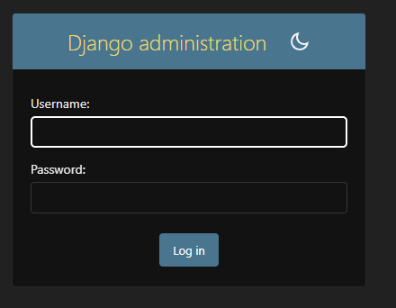
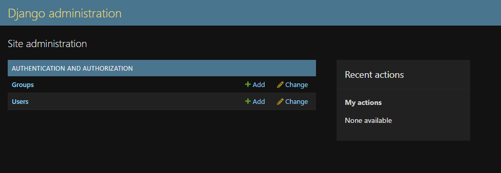

# Aula 2 - Comandos Django

## Ativar o ambiente virtual

```powershell
venv\Scripts\Activate.ps1
```

### Para que serve?

Ativa o ambiente virtual (`venv`) do projeto.

Após executar, o terminal passa a mostrar:

```text
(venv)
```

Isso indica que todas as bibliotecas instaladas serão adicionadas apenas a esse projeto.

---

## Instalar dependências

```powershell
pip install django djangorestframework django-cors-headers
```

### Para que serve?

Instala as bibliotecas necessárias para o projeto.

- `django` → Framework web em Python.
- `djangorestframework` → Criação de APIs REST.
- `django-cors-headers` → Permite que aplicações Front-end (como React ou Vue) acessem a API sem problemas de CORS.

---

## Criar um projeto Django

```powershell
django-admin startproject loja .
```

### Para que serve?

Cria um novo projeto Django.

Neste exemplo:

- `django-admin` → Ferramenta de gerenciamento do Django.
- `startproject` → Comando para criar um projeto.
- `loja` → Nome do projeto.
- `.` → Cria o projeto na pasta atual, sem criar uma nova pasta chamada `loja`.

---

## Criar uma aplicação (App)

```powershell
python manage.py startapp produtos
```

### Para que serve?

Cria uma aplicação dentro do projeto Django.

Neste exemplo:

- `python` → Executa o interpretador Python.
- `manage.py` → Arquivo responsável por administrar o projeto Django.
- `startapp` → Cria uma nova aplicação.
- `produtos` → Nome da aplicação criada.

Após executar, será criada uma pasta semelhante a:

```text
produtos/
├── admin.py
├── apps.py
├── migrations/
├── models.py
├── tests.py
├── views.py
└── ...
```

Cada aplicação representa um módulo do sistema. Por exemplo:

- produtos
- clientes
- pedidos
- usuários

Cada uma possui seus próprios modelos, views e arquivos de configuração.

---


## Criar migrações

```powershell
python manage.py makemigrations
```

### Para que serve?

Analisa os arquivos `models.py` das aplicações e cria arquivos de migração com as alterações encontradas.

Esses arquivos descrevem tudo o que deve ser alterado no banco de dados, como:

- criação de tabelas;
- adição de colunas;
- remoção de campos;
- alteração de tipos de dados.


Caso existam mudanças, será criada uma nova migração dentro da pasta:

```text
app/
└── migrations/
    └── 0002_nome_da_migracao.py
```

---

## Aplicar migrações no banco de dados

```powershell
python manage.py migrate
```

### Para que serve?

Executa todas as migrações pendentes e cria ou atualiza as tabelas do banco de dados.

Na primeira execução de um projeto Django, esse comando cria automaticamente diversas tabelas internas, como:

- usuários;
- permissões;
- grupos;
- sessões;
- painel administrativo.

### Resultado apresentado

```text
Applying contenttypes.0001_initial... OK
Applying auth.0001_initial... OK
Applying admin.0001_initial... OK
...
Applying sessions.0001_initial... OK
```

Cada linha representa uma migração aplicada com sucesso.

Sempre que uma nova migração for criada com `makemigrations`, será necessário executar novamente:

```powershell
python manage.py migrate
```

para atualizar o banco de dados.

---

## Criar um Superusuário

```powershell
python manage.py createsuperuser
```

### Para que serve?

Cria um usuário administrador para acessar o painel administrativo do Django.

Durante a execução, o terminal solicitará:

```text
Username: senai26
Email address: senai@gmail.com
Password: CFP...
Password (again): CFP...
```

Após preencher essas informações, o usuário administrador será criado.

### Resultado esperado

```text
Superuser created successfully.
```

Esse usuário poderá acessar o painel administrativo do Django normalmente.

---

## Ordem comum de criação de um projeto Django

```powershell
venv\Scripts\Activate.ps1
```

Ativa o ambiente virtual.

↓

```powershell
pip install django djangorestframework django-cors-headers
```

Instala as dependências.

↓

```powershell
django-admin startproject loja .
```

Cria o projeto.

↓

```powershell
python manage.py startapp produtos
```

Cria uma aplicação.

↓

*(Editar os arquivos `models.py`, se necessário.)*

↓

```powershell
python manage.py makemigrations
```

Gera as migrações.

↓

```powershell
python manage.py migrate
```

Aplica as migrações no banco de dados.

↓

```powershell
python manage.py createsuperuser
```

Cria o usuário administrador.

---

## Iniciar o servidor Django

```powershell
python manage.py runserver 0.0.0.0:8080
```

### Para que serve?

Inicia o servidor de desenvolvimento do Django.

Neste comando:

- `python` → Executa o interpretador Python.
- `manage.py` → Gerencia o projeto Django.
- `runserver` → Inicia o servidor web.
- `0.0.0.0` → Permite que o servidor aceite conexões de qualquer endereço da rede.
- `8080` → Define a porta utilizada pelo servidor.

Após executar o comando, o terminal exibirá uma mensagem semelhante a:

```text
Starting development server at http://0.0.0.0:8080/
```

O projeto poderá ser acessado pelo navegador através de:

```text
http://localhost:8080
```

ou

```text
http://127.0.0.1:8080
```

Se o projeto possuir o painel administrativo habilitado, ele estará disponível em:

```text
http://localhost:8080/admin
```

### Tela de Login





### Painel Administrativo

Após realizar o login com um superusuário, será exibido o painel administrativo do Django.





---